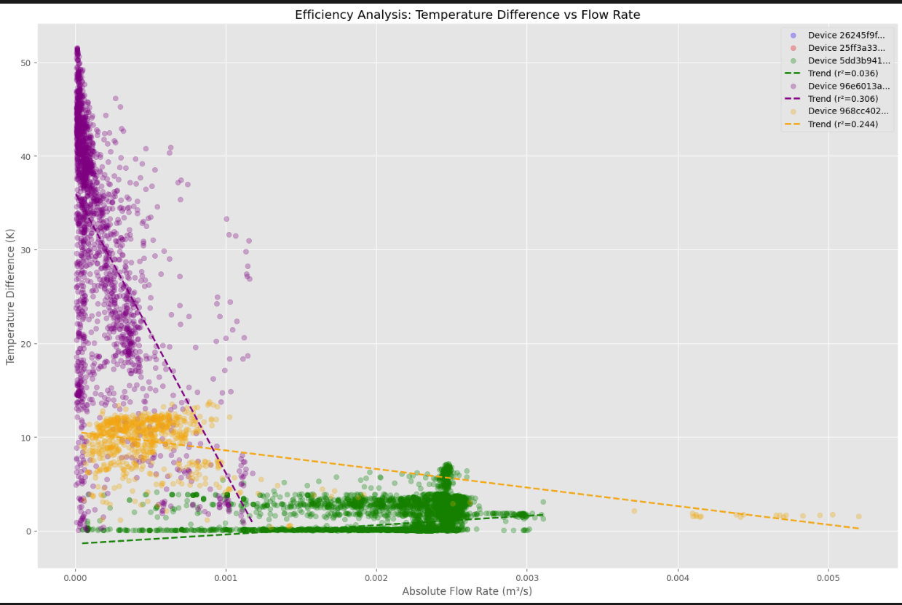
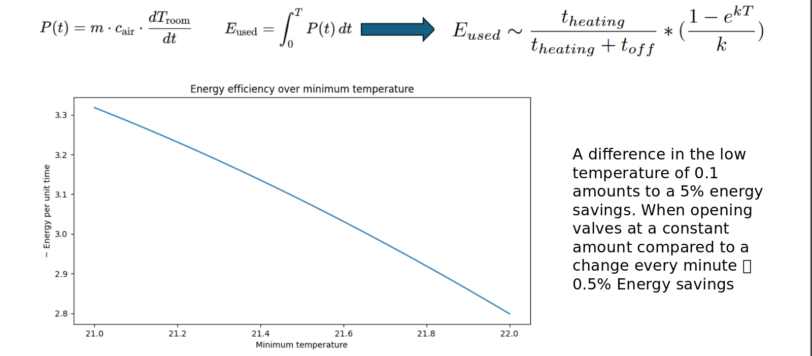

# Belimo x GitHard

**Tagline:** Revolutionizing HVAC Climate Solutions with Data-Driven Insights

---

## Table of Contents

- [Belimo x GitHard](#belimo-x-githard)
  - [Table of Contents](#table-of-contents)
  - [Project Title and Description](#project-title-and-description)
  - [Our Product](#our-product)
    - [Problem Statement](#problem-statement)
    - [Solution Overview](#solution-overview)
  - [Tech Stack and Dependencies](#tech-stack-and-dependencies)
  - [Setup and Installation Instructions](#setup-and-installation-instructions)
  - [Contributors](#contributors)

---

## Project Title and Description

**Smartsense: Smart HVAC Monitoring Platform**

Smartsne is an innovative solution developed in collaboration with Belimo that transforms how building managers monitor, analyze, and optimize HVAC systems. By leveraging data from over 9 years. 

---

## Our Product

### Problem Statement

Buildings account for approximately 40% of global energy consumption, with HVAC systems being the primary contributor. Most building managers lack proper tools to monitor their HVAC systems efficiently. We know that data harvested over 10 years can be used. Our AI, data-driven solution empowers users to optimize their devices.

### Solution Overview

Our solutions integrates AI to learn the data and reduce waist.


We have made multiple plots to analyse the data and come to our conclusion:

Also some calculations helped us to come to our conclusion:

So a lot of energy can be saved
## Tech Stack and Dependencies
Our project leverages a comprehensive tech stack:

- **Data Analysis**: Python ecosystem with Jupyter Notebooks, pandas, NumPy, and PySpark for processing large datasets
- **Data Visualization**: Matplotlib, Seaborn, and Plotly for interactive visualizations
- **Frontend**: Next.js with React for a responsive, modern user interface

## Setup and Installation Instructions

To set up the project locally, follow these steps:

1. **Clone the Repository**:
   ```bash
   git clone https://github.com/oiver12/StartHack25_GitHard.git
   cd StartHack25/webiste_nextJS
   ```

2. **Install Dependencies**:
   ```bash
   npm install
   ```
3. **Start the Development Server**:
   ```bash
   npm run dev
   ```

5. **Access the Application**:
   Open your browser and navigate to `http://localhost:3000`

---

---


## Contributors

- [Liv Richter](https://github.com/)
- [Oliver Baumgartner](https://github.com/oiver12)
- [Florian Borchard](https://github.com/)
- [Emanual Amacher](https://github.com/)

---